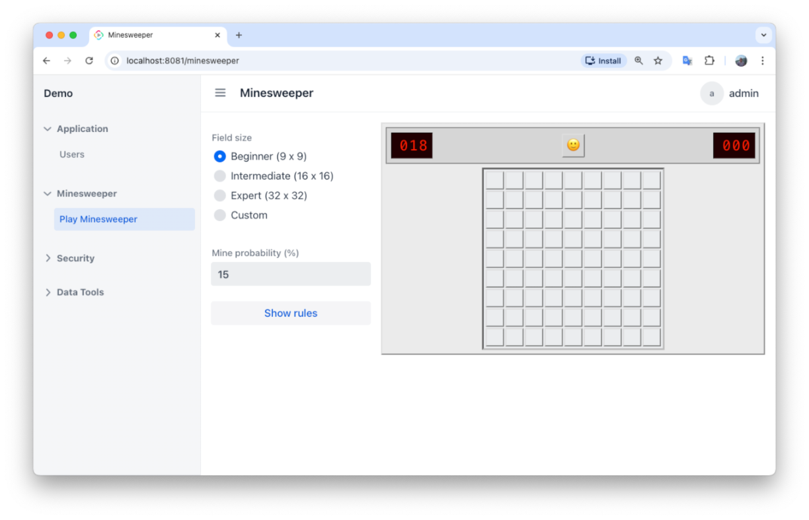
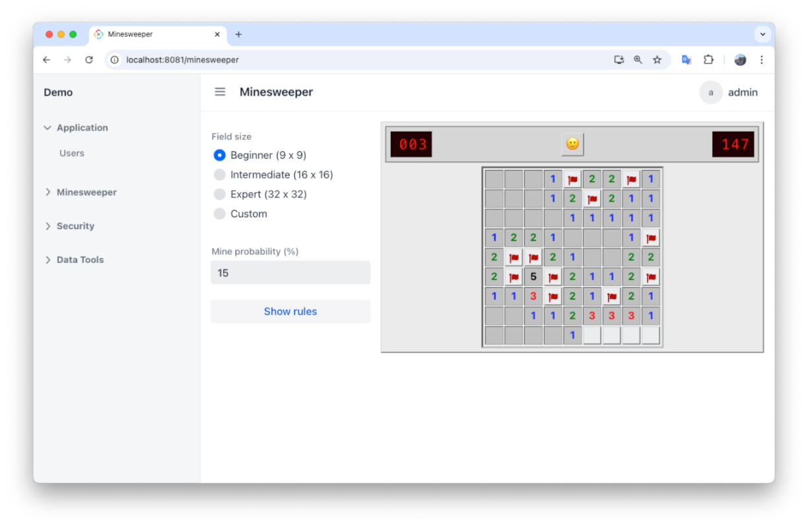
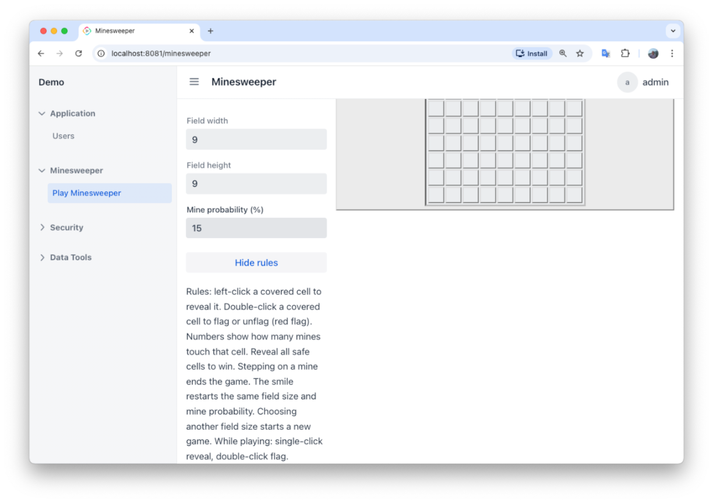

[](http://www.apache.org/licenses/LICENSE-2.0)

# Minesweeper for Jmix

**Source:** [github.com/digitilius/jmix-minesweeper](https://github.com/digitilius/jmix-minesweeper)

> **NOTE:**  
> This application fully generated by **Cursor**.  
>Not a single line of code was written manually.

This application is fully generated by **Cursor**. Not a single line of code was written manually.

Classic **Minesweeper** for [Jmix](https://www.jmix.io/): covered field, mine counter, timer, smile reset, and the usual reveal / flag / win–lose behaviour. Add the starter to your app; the game view is registered at **`/minesweeper`** inside the standard main layout (`io.jmix.flowui.view.DefaultMainViewParent`).



## Installation

Built for **Jmix 2.8.x** (see `jmixBomVersion` in [`gradle.properties`](gradle.properties) and the `jmix { bomVersion }` block in [`build.gradle`](build.gradle)). Use the **starter** so Boot loads auto-configuration.

| Jmix | Dependency                                                                                                                                                           |
|------|----------------------------------------------------------------------------------------------------------------------------------------------------------------------|
| 2.8.x | `io.github.digitilius.minesweeper:minesweeper-starter:1.0.4` ([Maven Central](https://repo1.maven.org/maven2/io/github/digitilius/minesweeper/minesweeper-starter/)) |

```gradle
dependencies {
    implementation 'io.github.digitilius.minesweeper:minesweeper-starter:1.0.4'
}
```

Do **not** use `io.github.digitilius:jmix-minesweeper` — that coordinate is not published; the runtime is split into **`minesweeper`** (library) and **`minesweeper-starter`** (Spring Boot entry point). Applications should depend only on **`minesweeper-starter`**.

### Minesweeper entry missing from the sidebar

If you only see your app’s own menu (Users, Security, …) and **no Minesweeper** block, your host **`application.properties`** must merge add-on menus with yours. Add (or set to `true`):

```properties
jmix.ui.composite-menu=true
```

Keep your existing `jmix.ui.menu-config=…` pointing at **your** `menu.xml`. This matches the demo in this repository (`demo/src/main/resources/application.properties`). See the Jmix docs on [menu configuration](https://docs.jmix.io/jmix/2.8/flow-ui/menu-config.html).

To confirm the add-on is loaded even without the menu item, open **`/minesweeper`** in the browser; if the game appears, fix menu merging or Flow UI **resource roles** for view id **`minesweeper_Minesweeper.view`**.

Use a fixed `<version>` for releases. The add-on registers **`MinesweeperView`** as **`minesweeper_Minesweeper.view`** with route **`minesweeper`**, the **Minesweeper** menu (`io/github/digitilius/minesweeper/menu.xml`), and **Play Minesweeper**.

## How to play

- Reveal all **non-mine** cells to **win**. Numbers count adjacent mines (including diagonals).
- **Single-click** a covered cell to reveal (short delay reduces mis-clicks).
- **Double-click** a covered cell to **flag** / unflag. The left display shows **mines − flags**.
- **Smiley** restarts with the same size and mine probability.
- The **timer** starts on the first successful **reveal** (not on a flag-only action).
- After **win** or **loss**, the field stays locked until you change **field size** or hit the smiley.



## Settings



| Control | Behaviour |
|---------|-----------|
| **Beginner / Intermediate / Expert** | 9×9, 16×16, or 32×32 |
| **Custom** | Shows width and height (bounded in the UI) |
| **Mine probability (%)** | Density for each new field; always visible |
| **Field size change** | Starts a new game immediately |
| **Show rules** | Toggles the help text in the side panel |

### `application.properties`

Prefix **`minesweeper`**:

| Property | Meaning |
|----------|---------|
| `minesweeper.width` | Default width (fallback) |
| `minesweeper.height` | Default height (defaults to `width`) |
| `minesweeper.mine-probability-percent` | Default mine density (%) |

The UI opens on **Beginner**; these values mainly seed defaults and fallbacks.

